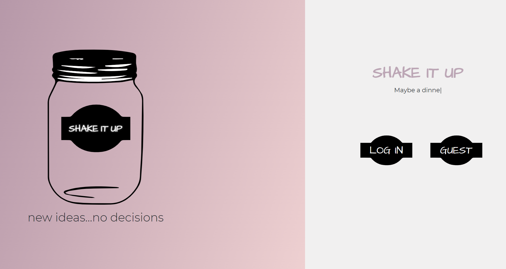
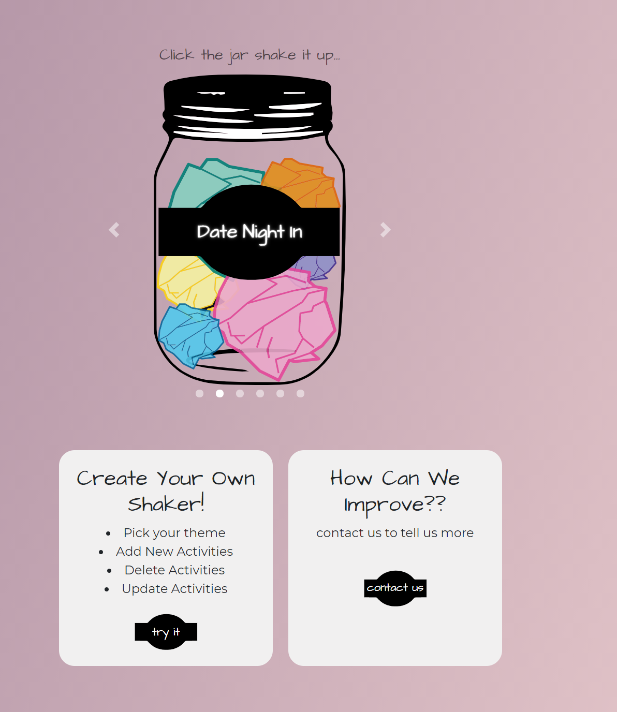
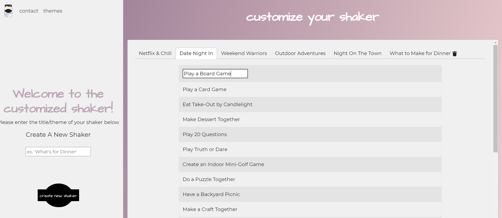

# MasonJar

## Description

Has it ever taken you forever to decide what to do on a Friday night? The creators of Shake It Up have developed a unique solution to this problem! 

Shake It Up is a fun and interactive application that allows users to randomly select from different categories. In these categories are activities that are randomally generated. The user can also decide to shake again if they draw an activity they do not like. Additional features include creating a custom category, adding new activities, delete and update activities, and login with a secure authentication. 

This application has full MERN and CRUD functionality. 

## Table of Contents 

* [Video](#video)
* [Installation](#installation)
* [Usage](#usage)
* [Credits](#credits)
* [License](#license)
* [Questions](#questions)
* [Future-Development](#future-development)
* [Heroku](#heroku)

## Video

NEED VIDEO HERE

## Installation

Steps to install project include:
* npm install the dependencies 

## Usage 

* This is the main page the user sees when entering our site. They need to login or sign up before they can enter the site. Auth0 was the authentication used in the application. 

* Once the user is logged in they are redirected to this page. This is where the user can pick what category they want an activity from. 

* On this page the user can add, edit, and delete shakers and shaker activities.

## Credits

All of the code was developed by:
 * Claire Bohlen
    * GitHub Username: ClaireBohlen
    * GitHub Profile: (https://github.com/ClaireBohlen)
 * Dana Kuglin
    * GitHub Username: dakuglin
    * GitHub Profile: (https://github.com/dakuglin)
 * Nora Curcio
    * GitHub Username: noracurcio
    * GitHub Profile: https://github.com/noracurcio)
 * Tessa Pierce 
    * GitHub Username: tesssapierce
    * GitHub Profile: (https://github.com/tesssapierce)
 * Katie Anilionis 
    * GitHub Username: Kanilionis
    * GitHub Profile: (https://github.com/Kanilionis)

## License

This project is licensed under MIT.

## Future-Development

Future development for this project includes allowing the user to pin activities they have done to their profile. This would be an awesome feature to have so the user could see the activities they have completed, and maybe even be able to rate the activity on how much fun they had doing it! In addition to this the users could maybe see categories that are very popular or trending with other users. 

Other features include having the paper components inside of the jars to move independently  of the jar itself. 

## Heroku

This application is deployed on Heroku and can be found at the following link: (https://shake-it-up.herokuapp.com/)